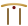

<div align="center">


[](https://github.com/xen-labs)


<sub>[`xen-labs`](#xen-labs) · [`ayakashi`](#ayakashi) · [`the vault`](#the-vault) · [`the grid`](#the-grid) · [`off the clock`](#off-the-clock) · [`say hi`](#say-hi)</sub>

</div>

<br/>

<div align="center"></div>

<br/>

<a name="xen-labs"></a>
<table align="center" width="100%">
<tr>
<td width="16%" align="center" valign="middle">


</td>
<td width="84%" valign="top">

 **xen-labs**<br/>

a one-person studio building anime-flavored bot & web experiences — economy systems, card-collecting mechanics, live companion chat. everything currently orbits **Ayakashi**.

<sub>[`@xen-labs`](https://github.com/xen-labs) · Kolkata, India</sub>

</td>
</tr>
</table>

<br/>

<div align="center"></div>

<br/>

<a name="ayakashi"></a>
<div align="center">


<br/>
<sub>⟡ the flagship project ⟡</sub>

</div>

<br/>

<table align="center" width="100%">
<tr>
<td width="58%" valign="top">


```yaml
ayakashi:
  role:     Founder, xen-labs
  status:   in development
  stack:    TypeScript · Node.js · MongoDB · Next.js
```

**an anime card-collecting game with browser mini-games.** pull cards, trade, climb leaderboards, come back for the mini-games in between.

</td>
<td width="42%" valign="top" align="center">


</td>
</tr>
</table>

<div align="center"><sub> the two repos </sub></div>

<br/>

<table width="100%">
<tr>
<td width="48%" valign="top" align="center">

<br clear="left"/>

**`ayakashi-core`**<br/>

the engine — card logic, gacha, trading, mini-game backends. also runs the companion chat integration.

<br/>
<br/>


</td>
<td width="4%" valign="middle" align="center">


</td>
<td width="48%" valign="top" align="center">

<br clear="left"/>

**[`ayakashi`](https://github.com/xen-labs/ayakashi)**<br/>

the browser side — mini-games, collection viewer, leaderboards, trading UI.

<br/>
<br/>


</td>
</tr>
</table>

<br/>

<div align="center">


<br/><br/>


</div>

<br/>

<div align="center"></div>

<br/>

<a name="the-vault"></a>
<table width="100%">
<tr>
<td width="33%" valign="top" align="center">


**something with computer vision**
<sub>private repo, cooking slowly</sub>

</td>
<td width="33%" valign="top" align="center">


**a CLI tool I actually use daily**
<sub>private repo, might open-source it eventually</sub>

</td>
<td width="33%" valign="top" align="center">


**next xen-labs thing**
<sub>too early to talk about</sub>

</td>
</tr>
</table>

<br/>

<div align="center"></div>

<br/>

<a name="the-grid"></a>
<div align="center">

[](https://github.com/kittinan/spotify-github-profile)

[](https://discord.com/users/1215706119297568839)

<br/>


<br/>


<br/>

<picture>
  <source media="(prefers-color-scheme: dark)" srcset="https://raw.githubusercontent.com/Xenkaii/Xenkaii/output/github-contribution-grid-snake-dark.svg" />
  
</picture>

</div>

<br/>

<div align="center"></div>

<br/>

<a name="off-the-clock"></a>
<div align="center">

  off the clock  

<sub>tactical shooter · open-world RPG · grand strategy · gym · manga</sub>

<br/>


<br/><br/>


<br/>

<br/>


<sub>Vinland Saga — the panel that lives rent-free</sub>

<br/><br/>


<br/>


<sub>⟡ marin kitagawa, resident menace ⟡</sub>

</div>

<br/>

<div align="center"></div>

<br/>

<a name="say-hi"></a>
<div align="center">

[](https://wa.me/916296247464?text=Yoo%20Xenkai)

<sub> Kolkata ⟡ xen-labs ⟡ Ayakashi</sub>


</div>
